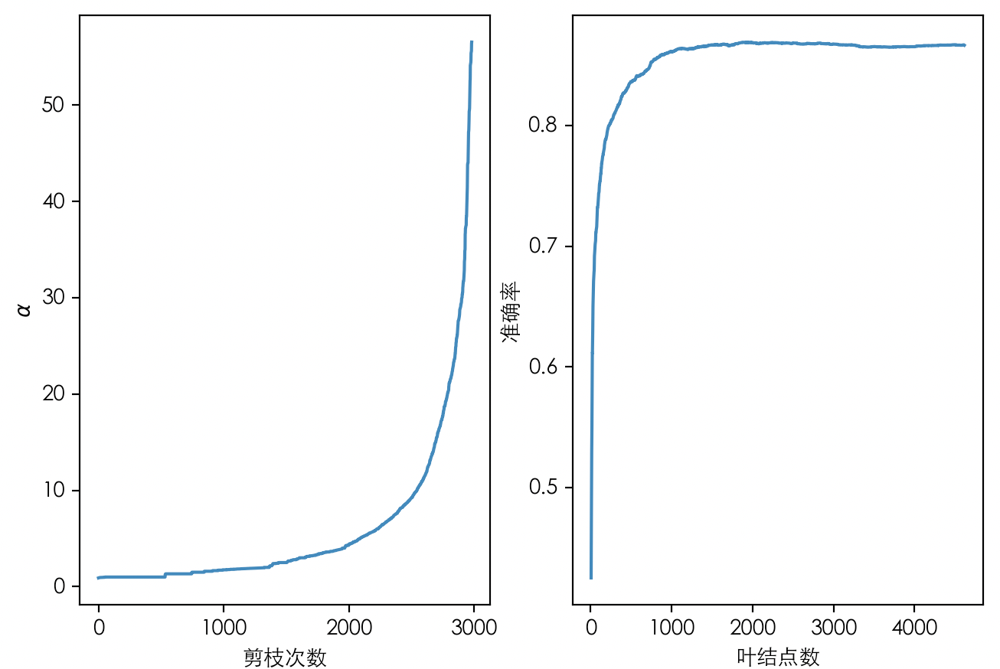

# CART分类树实现

## 数据集

Mnist

### 预处理

每个特征二值化：`0 if pix < 128 else 1`

## 建树

CART是一个二叉树，然后我这里采用了二值化，所以每次选择特征时，
仅需计算$\text{Gini}(D, A=1)$或者$\text{Gini}(D, A=0)$中的一个即可，
因为二者相等。

未剪枝前，实验结果(训练集 mnist 6万样本, 测试集 mnist 1万样本)
```
leaf node amount of current tree: 4617
<timeit  "model_test": 0.22700858116149902 s>
idx: 0, accuracy:0.8664
```
可以看到决策树算法运行效率较高，测试1万样本才用了0.22秒。

## 剪枝

### 损失函数的定义

这是遇到的第一个问题，李航的书上并没有给出CART分类树$C(T)$的明确定义，
只是说“如基尼系数”，但基尼系数是定义在一个分布（一个数据集）上的，
如何计算一颗子树上的基尼系数？

试着找了下资料也没找到明确的定义，找CART 1984年的paper也没找到。

#### 尝试定义损失函数

剪枝过程需要计算$g(t) = \frac{C(t) - C(T_t)}{|T_t| - 1}$，
所以关键是给出$C(t)$和$C(T_t)$的定义。

然后发现李航的书5.4节其实给出了一个基于熵的损失函数的定义，
那我们尝试在这里给出基于基尼系数的定义：
$$\begin{aligned}
C(T_t) &= \sum_{i=1}^{|T_t|} N_i \text{Gini}(T_i) \\
C(t) &= N_t \text{Gini}(t)
\end{aligned}$$
其中，$N_i$为$T_t$的某个叶结点$T_i$的样本数，
$N_t$为$T_t$剪枝为$t$后，$t$的样本数。

### 实现

按如上定义进行实现

#### 一些信息

测了下$T_0$有4233个结点，建树过程占用内存1757.6 KiB(树的表示)，
内存应该没有大问题，先不优化了，剪枝过程新树从旧树直接复制然后修改，
简单粗暴。

- $C(t)$的计算可以在建树时完成，存储在每个内部结点上。
全部剪枝过程仅需用到在$T_0$上计算的$C(T)$，即建树完毕后就可以不用再考虑$C(T)$了。
- $C(T_t)$的计算必须在建树完成后，从叶结点到根结点的整条路径上更新。
- $|T_t|$和$C(T_t)$同时计算，从叶结点到根结点累加式更新。

#### 实验

i7-8700k运行1159s，内存占用4.2GB，更多详细的log在`dt.log`
```
<timeit  "_get_pruned_trees": 321.2582457065582 s>
tree amount: 3133

leaf node amount of current tree: 1937
<timeit  "model_test": 0.2192826271057129 s>
idx: 2000, accuracy:0.869
```

可以看到生成了3133颗子树，其中正确率最高为$0.869$
(同不剪相比提高了$0.0026$，我掉的头发都不止这点长度，厘米单位)。



注意这里的`model_test`是直接泡在mnist 1万样本的测试集上的，本来应该交叉验证的，我懒。
